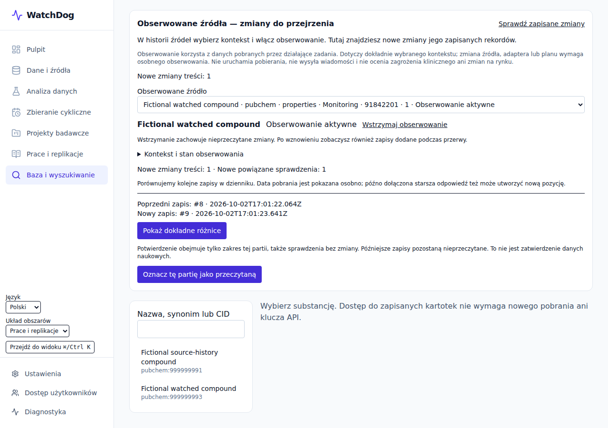

# WatchDog

A reproducible data and research workbench with explicit provenance, reviewed methods and verifiable runs. Monitoring psychoactive-substance signals is its first application; JH16 is the initial numerical benchmark.

[Project overview](docs/OVERVIEW.md) · [Development and evidence](docs/PROGRESS.md) · [Documentation](docs/README.md)



Application capture using fixture data; [image provenance](docs/assets/README.md).

| Area | Implemented flow |
|---|---|
| Sources and data | JSON/CSV import, tested extraction, source history and recurring collection |
| Analysis | Descriptive statistics, reviewed Pearson/Spearman analyses, 2D/3D figures, maps and data/SVG export |
| Research | Versioned projects, citations, selected paper operations, frozen scalar comparisons and verifiable result packages |
| Access and operation | Email/Google accounts, invitations and roles, PL/EN navigation, backups and isolated restore |

The accepted product has **613 passing local tests**, typechecking and a production build. [Acceptance records](docs/history/evidence/2026-10-02-completion/receipt.json) identify the tested code and retained logs. Live VM, external SMTP/OAuth and certificate acceptance remain outstanding. General autonomous replication and production clinical case APIs remain in the [development queue](docs/spec/07_EPICS_AND_TASKS.md).

## Run locally

```bash
npm ci
npx playwright install --with-deps chromium
npm run demo:jh16
npm run test:all
npm run dev
```

The keyless JH16 demo recomputes published values from published inputs; it is a pipeline self-check. Browser tests require Playwright Chromium. The [VM runbook](docs/DEPLOY_GCP_VM.md) describes installation and remote access.

## Development

Main contains accepted product increments with preserved ancestry. Synthetic G1–G3 pilots, full raw results and counterexamples remain on a [separate research branch](https://github.com/klb-t/Watchdog-JH16/tree/9c562d8d20ea2e129b44062080c138cb2adb1ceb/research/gpt-20261002). [History and replay](docs/history/EXPERIMENTS.md) document recovery and reproducibility. No original history was deleted or rewritten.

[Technical handoff for Claude](docs/HANDOFF_2026-10-02_TO_CLAUDE.md) · [Access](docs/ADMISSION.md) · [History policy](docs/HISTORY_POLICY.md) · [Agent contract](AGENTS.md)

## License

WatchDog is source-available under [PolyForm Noncommercial 1.0.0](LICENSE). Commercial use requires a [separate written license](COMMERCIAL_LICENSE.md).
